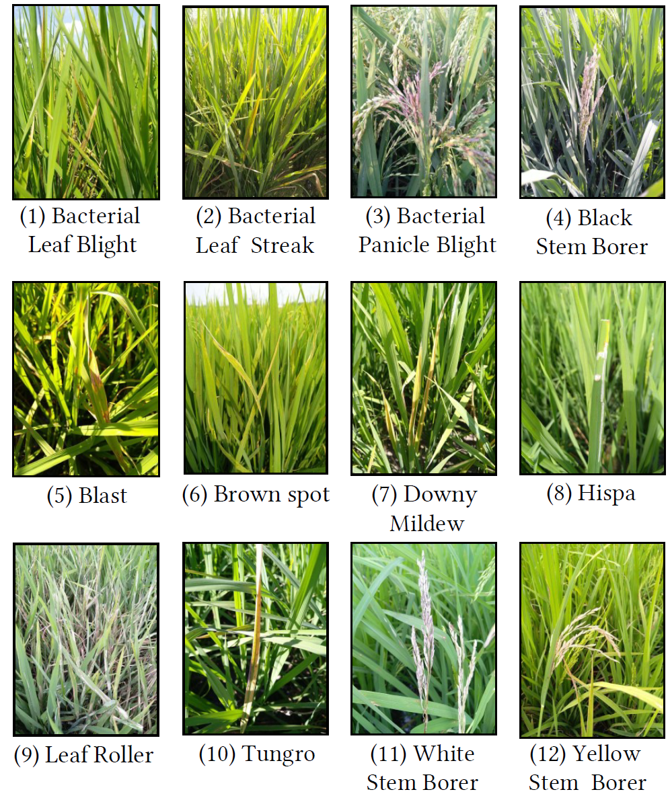

# Template to describe datasets

| Key                                  | Value                                                                                          |
|:-------------------------------------|:-----------------------------------------------------------------------------------------------|
| Dataset name                         | PaddyDoctor                                    |
| Publication link                     | [Paper](https://arxiv.org/abs/2205.11108)                                                      |
| Dataset download link                | [Dataset in Kaggle](https://www.kaggle.com/competitions/paddy-disease-classification/overview) |
| Imaging location                     |                                                                                                |
| Agricultural task                    | rice disease recognition                                                                       |
| Machine learning task                | image classification                                                                           |
| Machine learning challenge           |                                                                                                |
| Metric and performance, architecture | Acc 99.0%                                                                                      |
| Number of images                     | training: 10,407 test: 3,469                                                                   |
| Number of classes                    | 10                                                                                             |
| Crop and class                       | Rice leaf                                                                                      |
| Organ of interest                    |                                                                                                |
| Imaging environment                  |                                                                                                |
| Resolution of image                  | (1080, 1440)                                                                                   |
| Modality of optical sensors          |                                                                                                |
| Platform                             |                                                                                                |
| Annotation strategy                  |                                                                                                |
| Image variation                      |                                                                                                |
| Extra description                    |                                                                                                |

Examples of images and annotations if possible.
